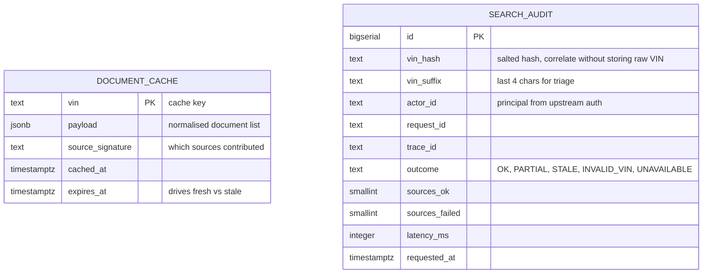
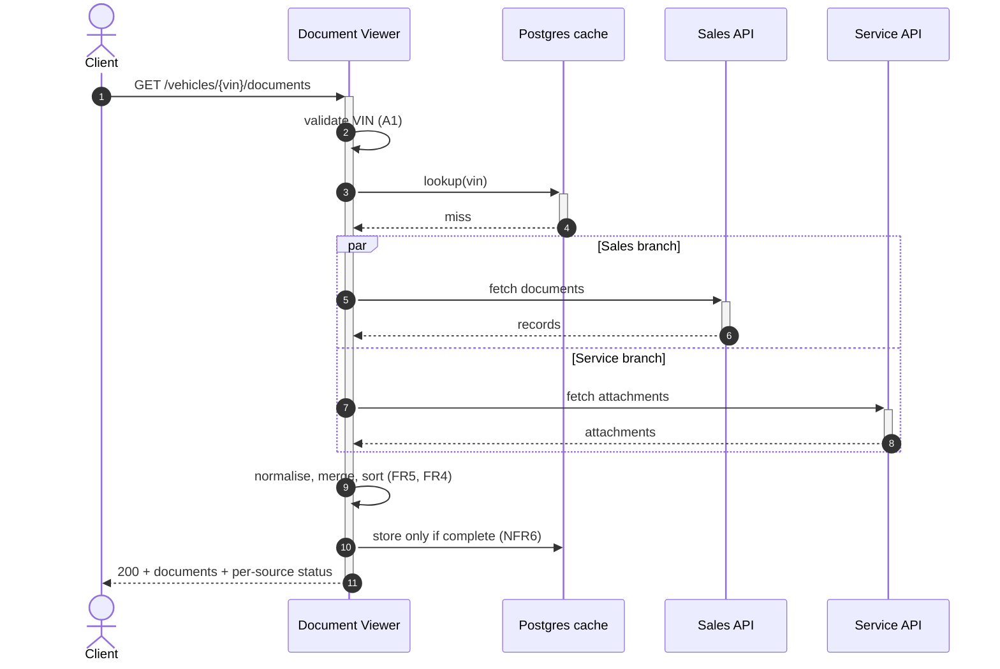
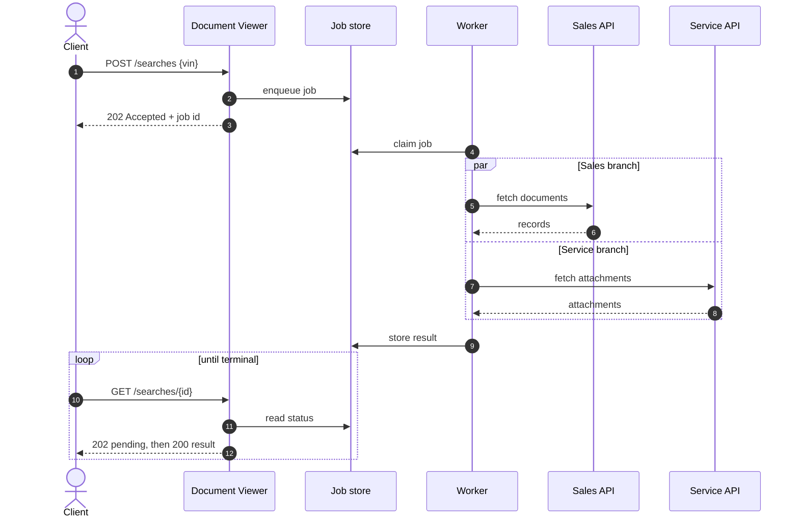
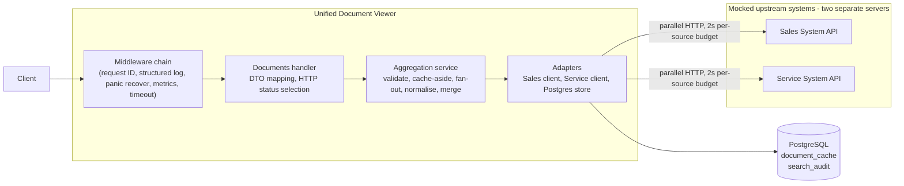
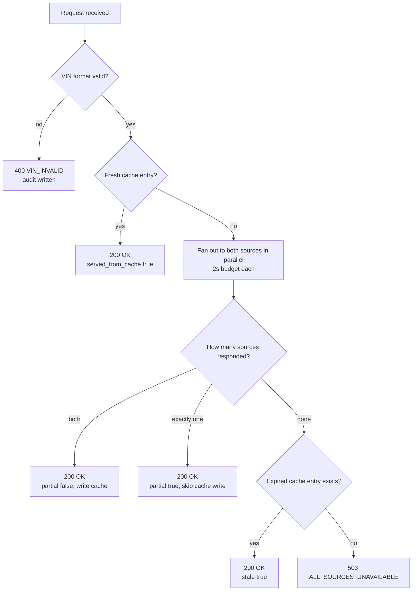

# DRAFT FOR ASSUMPTIONS

**Scenario D - The Unified Document Viewer**

---

## 1. Goal

Give dealership staff single VIN lookup that returns consolidated document list from two back-office systems (Sales + Service), with every item clearly attributed to its source, without opening two applications

## 2. Assumptions

| # | Assumption |
| --- | --- |
| A1 | VIN is validated for format only: 10 uppercase alphanumeric characters |
| A2 | Auth happen at upstream. This service no handle auth |
| A3 | Single-tenant for this service |
| A4 | Document is metadata + URL (title, type, issued_at, source, id, url) |
| A5 | This project use two separate mock API servers, and each API has a different response structure |
| A6 | Unknown VIN (no documents) return 200 with empty list, not 404 |
| A7 | If 1 upstream service (Sales + Service) fails/times out, still return documents from healthy source and report per-source status |
| A8 | Persistence is PostgreSQL, provisioned by `deployments/docker/docker-compose.yaml`. Chosen over an embedded database because the service needs real transactions and connection pooling, and over MongoDB because multi-document transactions there require a replica set |
| A9 | Upstreams are read-only and change slowly. 60s cache TTL is acceptable staleness |
| A10 | Document access is auditable. Every lookup is recorded, including failed and rejected ones |
| A11 | Cache stores document metadata only, never document bytes |

## 3. Scope

### In Scope
- Single VIN entrypoint
- Parallel requests to 2 mocked external APIs (Sales + Service)
- Normalization + merge into 1 list
- Partial failure handling
- **Persistence: response cache with TTL + append-only access audit**

### Out of Scope
- Full web UI
- Real Sales / Service production systems
- Document file streaming, download proxy, or in-app preview
- Authentication & authorization
- Multi-tenant dealership isolation
- Check vihicle-registry existence
- Deploy, dashboards, load measurement
- Cross-vehicle search or document analytics (would need a persisted document index, not a cache)

## 4. Requirements
### Functional requirements

| ID | Requirement |
| --- | --- |
| FR1 | The system shall provide single search interface that accepts VIN |
| FR2 | Backend shall request documents from 2 mocked external APIs: Sales and Service |
| FR3 | Upstream requests run in parallel |
| FR4 | The system shall return one consolidated document list; each item shall include a clear `source` (Sales or Service) |
| FR5 | The system shall normalise dissimilar upstream payloads into one document model (metadata + URL) |
| FR6 | A well-formed VIN with no documents in either system shall return HTTP 200 and an empty list (not 404) |
| FR7 | If one upstream fails or times out, the system shall still return documents from the healthy source and report per-source status |
| FR8 | The system shall persist an append-only audit record for every lookup, including failed and rejected ones |
| FR9 | The system shall serve a cached result while it is within TTL, and indicate that it came from cache |
| FR10 | When all upstreams fail, the system shall serve an expired cached result marked `stale`, or return 503 if no cached result exists |

### Non-functional requirements
| ID | Requirement |
| --- | --- |
| NFR1 | One upstream failure shall degrade the response, not fail the whole request when the other source is healthy |
| NFR2 | Each upstream call shall have an isolated timeout budget |
| NFR3 | E2E upstream wait shall approximate the slower source, not the sum of both |
| NFR4 | The HTTP request shall complete within a declared overall timeout budget |
| NFR5 | Partial success/failure shall be visible in logs and/or metrics and/or traces (per-source status) |
| NFR6 | A partial (degraded) result shall never be written to cache |
| NFR7 | A cache read failure shall not fail the request. Treat as miss, log, continue to upstreams |
| NFR8 | The audit trail shall be append-only. No update, no delete |

## 5. Persistence design

### 5.1 Why a database at all

This service is a stateless aggregator, so persistence has to earn its place rather than be added because the brief asks for it. Two real uses justify it:

| Use | What it solves |
| --- | --- |
| Response cache with TTL | Protects upstreams from repeated identical lookups, and cuts response time on a hit from ~2s to single-digit ms |
| Append-only access audit | Answers who looked at which vehicle's documents and when. Real compliance concern for dealer document handling |

The cache also adds a third availability tier. Without it the service has two outcomes: full result, or partial result. With it there is a fallback when **both** upstreams are down, which is the one case the partial-failure design (A7) cannot handle on its own.

### 5.2 Tables

`payload` is `jsonb` rather than an opaque blob, so a cached entry stays inspectable in the database without going through the application.

Indexes: `document_cache(expires_at)` for sweeping expired rows, `search_audit(requested_at)` and `search_audit(vin_hash)` for compliance queries.

### 5.3 Cache rules

| Rule | Reason |
| --- | --- |
| Only write a **complete** result (NFR6) | Caching a partial result lets one transient upstream blip poison every response for the full TTL, turning a 2s incident into a 60s one |
| Serve fresh hit within TTL (FR9) | Normal cache behaviour |
| Serve **expired** entry when all sources fail, mark `stale` (FR10) | Slightly outdated documents beat an error page for a read-only view |
| Cache read error fails **open** (NFR7) | The database is a new failure surface. It must not be able to take down a request path that could otherwise have succeeded |
| Key is VIN only | Single-tenant (A3). Multi-tenant would key on `dealership_id + vin` |
| Expiry is enforced on **read**, not by the database | A row past `expires_at` is still useful for the stale fallback (FR10). Deleting it on expiry would destroy the only thing that answers a total outage. A periodic sweep removes rows far past expiry |

### 5.4 What is deliberately not persisted

| Not stored | Reason |
| --- | --- |
| Document bytes (A11) | A4 says metadata + URL. File storage has different scaling and security characteristics |
| Normalised documents as a queryable index | That is a replication system with backfill and reconciliation. It also moves the parallel fan-out off the request path, which requirement 2 of the brief explicitly asks for |
| Raw VIN in the audit table | Stored as salted hash + last 4 chars. A VIN plus dealer records identifies a person, and audit tables are long-lived. Suffix is 4 rather than 6 because the identifier is only 10 characters, so a 6-char suffix would expose most of it |

## 6. Architecture options

Two shapes for how a search is served. Both are mine; the numbering here is the source of truth and
is reused wherever these options are referenced.

### 6.1 Option 1 - Synchronous parallel fan-out with cache and audit **(chosen)**

One request, one response. The service validates the VIN, checks the cache, fans out to both
upstreams in parallel, merges, and answers.

**Pros**
- One request, one response. Matches FR1's "single search interface"
- The parallel fan-out stays on the request path, which is what requirement 2 of the brief asks for
- Cache and audit give the persistent database a real job (FR8, FR9, FR10) instead of a decorative one
- Stale fallback covers the one case NFR1 cannot: both upstreams down at once

**Cons**
- The client waits for the slower source, though NFR2 bounds that at 2s
- The cache adds invalidation rules and a second failure surface. Contained by NFR6 (never cache a partial result) and NFR7 (a cache read failure fails open)

### 6.2 Option 2 - Asynchronous job-based aggregation

The search becomes a job. The client gets an ID immediately and polls for the result while a worker
does the fan-out.

**Pros**
- The client is never blocked by a slow upstream
- Scales cleanly if more sources are added, or if one becomes genuinely slow
- The result survives the client disconnecting
- Retry and backpressure become explicit rather than implicit

**Cons**
- Two round trips for what FR1 describes as a single search interface
- Needs a job store, a worker, job expiry and terminal-state handling
- The client stub ends up more complex than the service it is demonstrating
- All of that machinery to manage a fan-out already bounded at 2s by NFR2

### 6.3 Decision

**Option 1.** Asynchronous aggregation is the right answer when upstream latency is measured in tens
of seconds, or when there are many sources, or when surviving client disconnection matters. None of
those hold here: two sources, a 2 second per-source budget, and a read that a user is waiting on.
The job machinery would cost more than it saves.

Revisit if upstream p99 rises above roughly 10 seconds, or the source count grows beyond a handful.

## 7. Architecture

## 8. Request flow with cache

