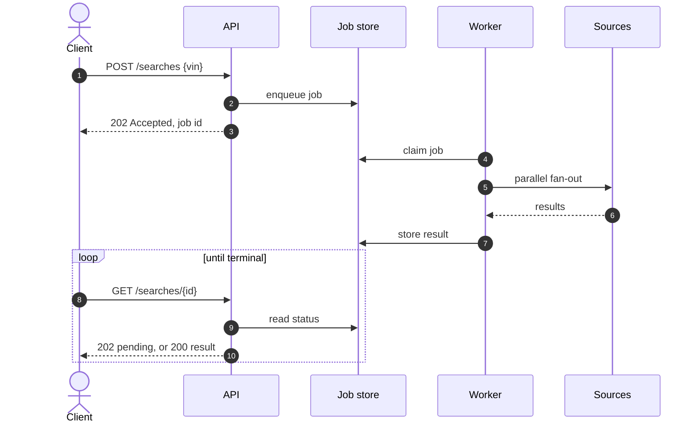
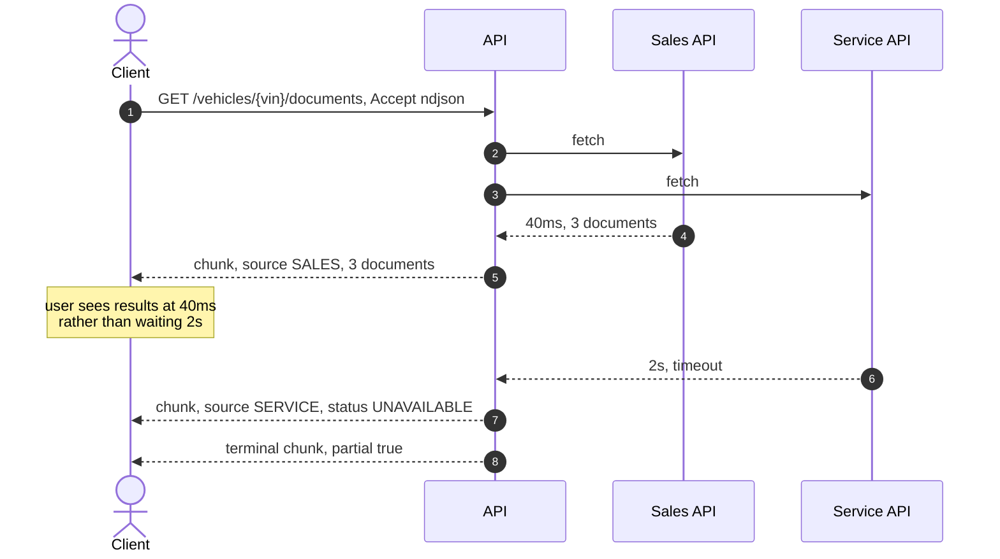
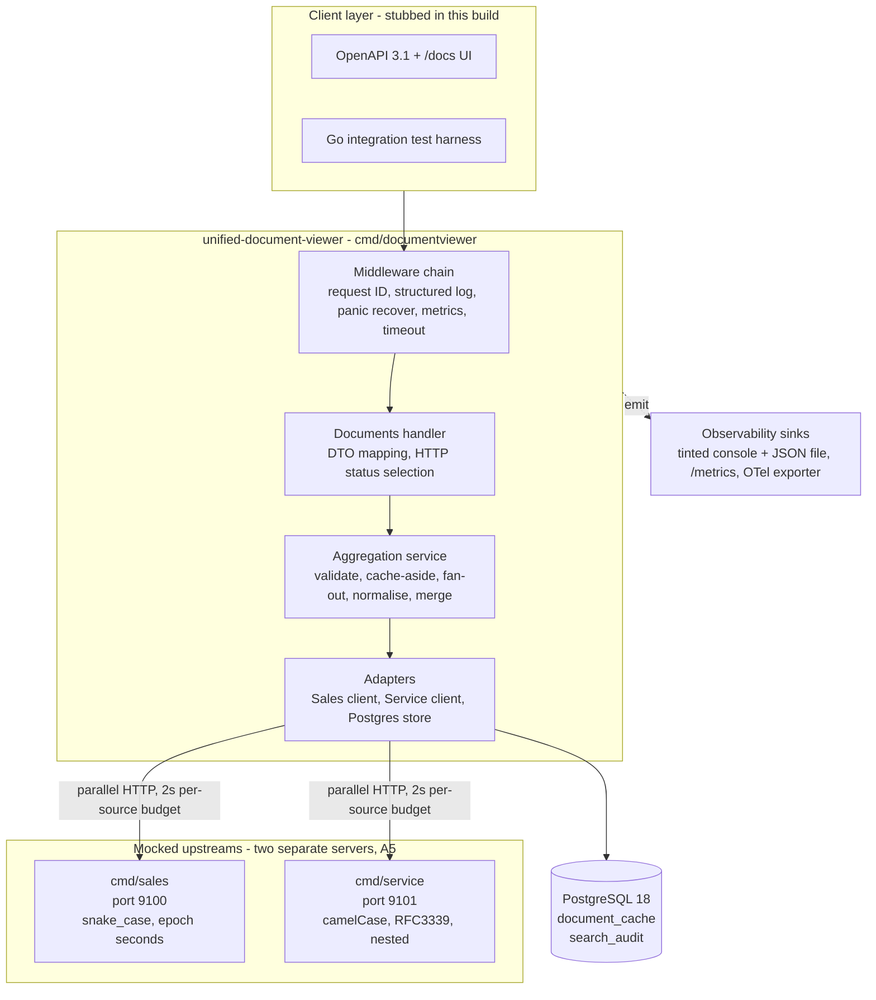
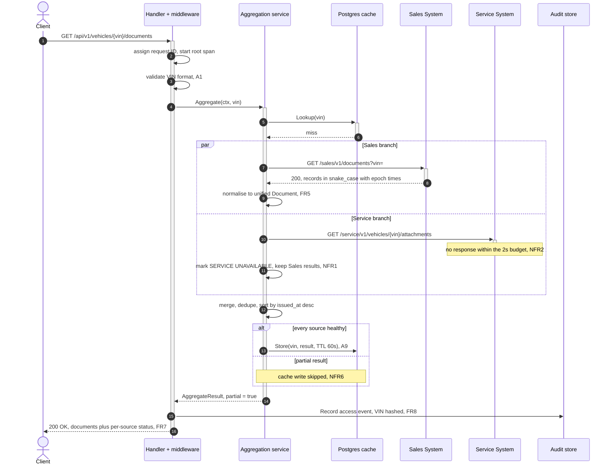
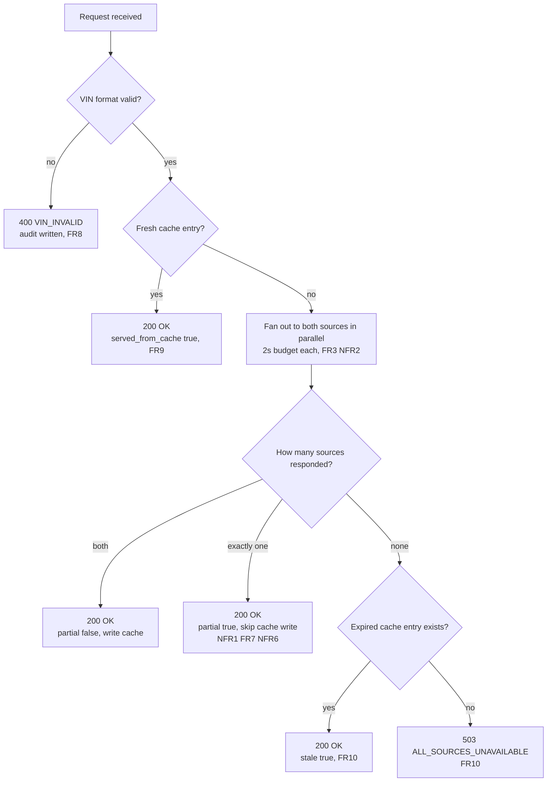
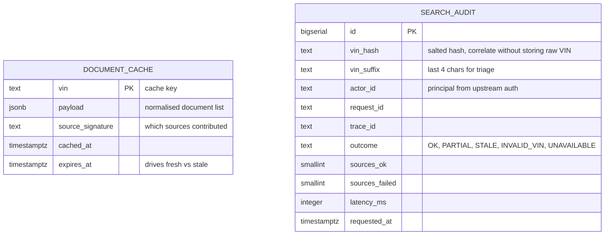
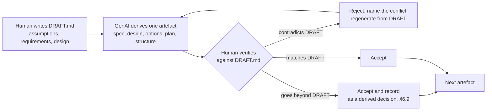

# System Design Document

**Scenario D - The Unified Document Viewer**
Keyloop Technical Assessment | Domain: Operate | Implemented layer: **Backend (Go)**

Author: ducnd58233
Version: 3.0

> **Provenance.** This document is derived from [`DRAFT.md`](DRAFT.md), which holds the goal,
> assumptions (A1-A11), scope, requirements (FR1-FR10, NFR1-NFR8) and persistence design.
> `DRAFT.md` is the source of truth. Where this document adds anything not present there, it is
> collected in [§6.9 Derived decisions](#69-decisions-derived-here-not-in-draftmd) so the addition is
> visible rather than smuggled in.

---

## 0. Requirement coverage map

The brief lists six required elements for Part 1.

| Brief requirement (Part 1) | Section |
|---|---|
| An architecture diagram | [3. Architecture](#3-architecture) |
| A brief description of each component's role | [4. Component responsibilities](#4-component-responsibilities) |
| An explanation of the data flow | [5. Data flow](#5-data-flow) |
| A list of chosen technologies with justifications | [7. Technology choices](#7-technology-choices-and-justification) |
| Your strategy for observability | [8. Observability strategy](#8-observability-strategy) |
| A dedicated section on GenAI use in design | [10. GenAI collaboration in the design phase](#10-genai-collaboration-in-the-design-phase) |

The architecture is the author's own, stated in `DRAFT.md` §6 and confirmed against four further
candidates proposed during design; that evaluation is [§2](#2-architecture-selection).
Scenario acceptance criteria and every `DRAFT.md` requirement are traced in [§11](#11-traceability).

---

## 1. Problem and scope

### 1.1 Goal

From `DRAFT.md` §1:

> Give dealership staff a single VIN lookup that returns a consolidated document list from two
> back-office systems (Sales + Service), with every item clearly attributed to its source, without
> opening two applications.

Documents for one vehicle live in at least two disconnected systems. A Sales System holds purchase
invoices, finance contracts and registration paperwork. A Service System holds work orders,
inspection reports and warranty claims. Staff open both and reconcile by eye.

### 1.2 Scope

Taken directly from `DRAFT.md` §3.

| In scope | Out of scope |
|---|---|
| Single VIN entrypoint | Full web UI |
| Parallel requests to two mocked external APIs | Real Sales/Service production systems |
| Normalisation and merge into one list | Document streaming, download proxy, in-app preview |
| Partial failure handling | Authentication and authorisation |
| Persistence: TTL response cache + append-only access audit | Multi-tenant dealership isolation |
| | Vehicle-registry existence checks |
| | Deploy, dashboards, load measurement |
| | Cross-vehicle search or document analytics |

Per the brief, one service layer is implemented fully. This submission implements the **backend**;
the client layer is stubbed with an OpenAPI 3.1 contract (served at `/openapi.json` and `/docs`) and a Go integration harness.

### 1.3 The central engineering problem

`DRAFT.md` NFR1 states that one upstream failure must degrade the response rather than fail it. That
single requirement is what makes this more than a proxy.

A composite read is only as available as its least available dependency unless deliberately designed
otherwise. Two upstreams at 99% availability compose to roughly 98%. Every resilience decision in
§6 follows from refusing that arithmetic.

`DRAFT.md` §5.1 extends it: the cache adds a third availability tier, covering the one case NFR1
cannot - when **both** upstreams are down.

| Upstream state | Outcome | Requirement |
|---|---|---|
| Both healthy | Full result, cached | FR4 |
| One healthy | Partial result, not cached | NFR1, FR7, NFR6 |
| Neither, fresh cache exists | Cached result | FR9 |
| Neither, expired cache exists | Stale result, flagged | FR10 |
| Neither, no cache | `503 ALL_SOURCES_UNAVAILABLE` | FR10 |

---

## 2. Architecture selection

A design that never names its alternatives cannot be audited - it can only be believed. Six were
weighed. Two of them are the author's, stated in `DRAFT.md` before any of this document existed.

### 2.1 The candidates, and where they came from

`DRAFT.md` §6 is the source of truth for Options 1 and 2 and owns the numbering used here. Options 3
to 6 were proposed by GenAI when the evaluation was widened, and each was checked back against
`DRAFT.md` before being recorded - the working method is described in §10.

| # | Shape | Origin | Decision |
|---|---|---|---|
| **1** | Synchronous parallel fan-out, TTL cache, append-only audit | **Author** - `DRAFT.md` §6.1 | ✅ **Selected** |
| **2** | Asynchronous job-based aggregation: accept a job, return an ID, client polls | **Author** - `DRAFT.md` §6.2 | ❌ Two round trips for a 2-second fan-out |
| 3 | Call both upstreams in parallel, merge, respond. Store nothing | Proposed by GenAI | ❌ No persistence - fails K1 |
| 4 | Copy every document into a local index and serve reads from it | Proposed by GenAI | ❌ A synchronisation product, and it moves the fan-out off the request path |
| 5 | Stream results per source as each arrives instead of waiting | Proposed by GenAI | ❌ Best perceived latency, but a harder contract for no required gain |
| 6 | Compose the upstreams declaratively at a gateway or federated graph | Proposed by GenAI | ❌ Handles normalisation and partial success worst |

`DRAFT.md` §6.3 already selected Option 1. Widening the field to six did not change that conclusion;
§2.9 records why. The four added options are kept rather than deleted because a rejected alternative
that was never written down cannot be reviewed.

### 2.2 Constraints that bind

Options are scored against the constraints that actually bind, not against generic best practice.

| Constraint | Source | Why it binds |
|---|---|---|
| **K1** Backend must expose REST **and use a persistent database** | Brief, Part 2 | Explicit written requirement. An option that skips persistence fails it outright |
| **K2** The backend must make **parallel** requests to two mocked APIs | Brief, Scenario D req. 2; `DRAFT.md` FR2, FR3 | The only requirement in the entire brief that prescribes backend behaviour. It must be on the hot path, not hidden behind a cache |
| **K3** One upstream failure must degrade, not fail | `DRAFT.md` NFR1, FR7 | The governing design constraint (§1.3) |
| **K4** The solution must not exceed the problem | Engineering judgement | The scenario is one read endpoint over two upstreams. An option whose cost is dominated by machinery no requirement asks for is the wrong answer regardless of its merits |
| **K5** Reviewer must be running it within one command | `DRAFT.md` A8 | `make dev` starts Postgres via compose, applies migrations, both mocks and the API. Docker is the only prerequisite. A submission a reviewer cannot run immediately gets judged on less evidence, so the database ships with the repository rather than being something they must provision themselves |
| **K6** Must demonstrate on video in 5-10 minutes | Brief, deliverable 3 | An architecture that cannot be shown degrading on camera wastes its best moment |

---

### 2.3 Option 1 - Fan-out + read-through cache + audit trail ✅ SELECTED

> **Author's option**, from `DRAFT.md` §6.1. Validate, check the cache, fan out to both upstreams in
> parallel, merge, answer. PostgreSQL carries a TTL response cache that doubles as a stale-while-error
> fallback, plus an append-only access audit - A8, A9, A10, A11, FR8, FR9, FR10, NFR6, NFR7, NFR8.

**Pros**
- Satisfies K1 with a database that earns its place **twice**: the cache protects upstreams (FR9), the audit answers a real compliance question about who viewed which vehicle's documents (FR8, A10)
- Keeps the parallel fan-out on the request path, where K2 requires it
- One request, one response - matches FR1's "single search interface"
- Adds a third availability tier - fresh, partial, **stale** - so the service still answers when *both* upstreams are down (FR10), the one case NFR1 alone cannot cover

**Cons**
- The client waits for the slower source, though NFR2 bounds that at 2s
- Cache invalidation becomes a design question, and deterministic tests need an injectable clock
- The database is a new failure surface - which is exactly why NFR7 requires a cache read to fail **open**: log, count, treat as a miss, continue to upstreams
- A cache can mask a partial outage, which is why NFR6 forbids caching a degraded result

**✅ Selected.** See §2.9 for the comparison that confirmed it.

---

### 2.4 Option 2 - Asynchronous job-based aggregation

> **Author's option**, from `DRAFT.md` §6.2. `POST /searches` returns `202` with a job ID; a worker
> performs the fan-out; the client polls `GET /searches/{id}` until it is complete.



**Pros**
- Fully decouples client latency from upstream latency
- Scales to many sources, or to genuinely slow ones
- Retry and resumption become natural, and backpressure is explicit
- Survives client disconnection - the result is waiting when they come back

**Cons**
- Two or more round trips for what FR1 calls a "single search interface"
- Requires a job store, a worker, terminal-state handling and job expiry
- The client stub ends up more complex than the service being demonstrated
- All of that machinery to manage a fan-out already bounded at **2 seconds** by NFR2

**❌ Rejected as premature.** The threshold where it becomes the right answer is worth stating
precisely: upstream p99 above roughly 10 seconds, **or** more than about ten sources, **or** a
requirement to survive client disconnection. None hold here. Revisit trigger recorded in §9.6.

---

### 2.5 Option 3 - Stateless fan-out, no persistence

> Proposed by GenAI. Option 1 with the database removed: call both sources in parallel, merge,
> respond, store nothing.

**Pros**
- The simplest thing that can satisfy the functional requirements
- Fewest moving parts: no cache-consistency questions, no second failure surface
- Every line of code is about the actual problem

**Cons**
- **Fails K1 outright** - the brief requires a persistent database
- Every request hits both upstreams with no protection
- No audit trail, so FR8 cannot be met
- Availability is bounded entirely by upstream health, with no fallback when both are down

**❌ Rejected.** Avoiding one adapter and two tables is not worth failing an explicit written
requirement. Still worth naming in the video as the honest baseline the persistence layer was added
*on top of*, rather than pretending the database was always essential.

---

### 2.6 Option 4 - Persisted document index (local replica)

> Proposed by GenAI. Normalised documents stored in PostgreSQL as a queryable index. Reads served from
> the database; upstreams polled on miss or refreshed by a background job.

**Pros**
- Fastest reads by a wide margin
- The database becomes genuinely core rather than supporting
- Unlocks capabilities no other option offers: cross-vehicle search, "all invoices issued this month", analytics
- Survives a total upstream outage indefinitely, not just for a TTL

**Cons**
- **It is a different product.** A synchronisation system needs backfill, incremental refresh, deletion detection, reconciliation, staleness ownership, and an answer for when replica and source disagree. Well beyond K4
- **It weakens K2**, which is the fatal one: serving reads from a local index means the backend no longer makes parallel upstream requests on the request path - the one behaviour the scenario explicitly prescribes

**❌ Rejected.** Technically the strongest option on every axis except the one that matters. Correct
destination if this grew into a document platform; wrong answer to the question asked. Recorded as
future direction in §9.6.

---

### 2.7 Option 5 - Streaming response (NDJSON or SSE)

> Proposed by GenAI. Results emitted per source as they arrive rather than waiting for the slowest.



**Pros**
- The best *perceived* latency of any option. When Service times out at 2s the user sees the Sales documents at 40ms instead of a spinner
- Serves K3 in the dimension users actually feel
- Reuses the same aggregator core - streaming changes only how results are *written*, not how they are *gathered*

**Cons**
- Awkward to demonstrate with curl (K6) and to describe in OpenAPI
- Caching a stream is meaningfully harder than caching one document
- A harder contract for a consumer to adopt
- The brief asks for a "consolidated list", which one JSON document expresses more directly

**❌ Rejected for the default contract, retained as a documented extension.** The strongest of the
rejected options and worth raising in the video, because adopting it later costs only a new writer,
not a new design. Revisit trigger recorded in §9.6.

---

### 2.8 Option 6 - Gateway or GraphQL federation

> Proposed by GenAI. Compose the two upstreams declaratively at an API gateway or federated graph
> instead of writing a service.

**Pros**
- Little bespoke code for the happy path
- Schema-driven, with standard tooling and standard operational practice

**Cons**
- The two hard parts of this problem are precisely what declarative composition handles **worst**: normalising dissimilar legacy payloads (epoch versus RFC3339, nested versus flat, differing type vocabularies), and expressing *partial* success with per-source attribution
- Both end up as hand-written resolvers - the same code, with a framework on top
- GraphQL's partial-error model returns `data` alongside `errors`, which is close but leaves per-source health and latency unexpressed
- It does not satisfy the brief, which asks the candidate to build the backend

**❌ Rejected.** Recorded to show the option was considered rather than overlooked.

---

### 2.9 Decision

Author's options are marked ✍; the rest were added when the field was widened.

| | **✍ O1 Cache + audit** | ✍ O2 Async | O3 Stateless | O4 Index | O5 Streaming | O6 Gateway |
|---|---|---|---|---|---|---|
| K1 persistent database | **✓ justified** | ✓ job store | ✗ fails | ✓ core | ✗ fails | ✗ |
| K2 parallel on hot path | **✓** | ✓ deferred | ✓ | ✗ weakened | ✓ | ~ |
| K3 degrades, not fails | **✓ plus stale tier** | ✓ | ✓ | ✓ strongest | ✓ best perceived | ~ weak |
| K4 proportionate scope | **✓ +1 adapter, 2 tables** | ✗ job store + worker | ✓ minimal | ✗ a sync product | ~ streaming contract | ✗ a platform |
| K5 two-command setup | **✓** | ✗ | ✓ | ~ | ✓ | ✗ |
| K6 demos well | **✓** | ✗ | ~ | ~ | ~ curl-hostile | ✗ |
| Availability, all upstreams down | **stale cache** | none | none | full | none | none |

> ### ✅ Selected: Option 1 - synchronous parallel fan-out with a read-through cache and audit trail
>
> **It is the only column with no ✗.**
>
> The decisive comparisons are with its two nearest rivals. **Against Option 3**, one adapter and two
> tables buy compliance with an explicit written requirement (K1) plus an availability tier that
> covers the total-outage case NFR1 cannot reach. **Against Option 4**, which is technically stronger
> on every axis except the one that matters: serving reads from a local index moves the parallel
> fan-out off the request path, and that fan-out is the single behaviour the scenario prescribes.
>
> This confirms the choice already made in `DRAFT.md` §6.3. Option 1 is the architecture detailed in
> the rest of this document.

The triggers that would reopen this decision are recorded in §9.6, so the choice stays reviewable
as the system evolves rather than calcifying.


---

## 3. Architecture

### 3.1 Container view

Expanded from `DRAFT.md` §7.



*The service is a single stateless binary. The only stateful component is PostgreSQL, holding a
rebuildable cache and an append-only audit trail. Losing it costs latency and audit history, never
the correctness of a response - which is why NFR7 requires a cache read failure to fail open.*

**Two separate mock servers, per A5.** This is not incidental. Running each upstream as its own
process on its own port means the fan-out crosses two real sockets, so the timeout budget (NFR2),
cancellation and parallelism (FR3, NFR3) are genuinely exercised rather than simulated. It also lets
the demo kill one server outright to show FR7.

### 3.2 Internal structure: ports and adapters

Domain logic depends on interfaces, never on HTTP clients or SQL. This is what makes the failure
matrix in §9.4 testable with no network.

```go
// internal/documentviewer/modules/documents/app/ports.go
type DocumentSource interface {
    Name() domain.SourceName
    Fetch(ctx context.Context, vin string) ([]domain.Document, error)
}

type DocumentCache interface {
    Lookup(ctx context.Context, vin string) (domain.CachedResult, bool, error)
    Store(ctx context.Context, vin string, r domain.AggregateResult, ttl time.Duration) error
}

// internal/documentviewer/modules/audit/app/ports.go
type AccessRecorder interface {
    Record(ctx context.Context, e domain.AccessEvent) error  // append-only, NFR8
}

// internal/shared/infra/postgres - the transaction boundary (R4)
// Use cases open it; repositories never begin, commit or roll back.
type UnitOfWork interface {
    Within(ctx context.Context, fn func(ctx context.Context) error) error
}
```

### 3.3 Module layout

The codebase is organised as **vertical slices**. Each module owns its own `api`, `app`, `domain`,
`dto` and `infra`; cross-cutting technical concerns live in `shared`. Configuration is a package at
the repository root.

`api` is the driving (inbound) adapter; `infra` is the driven (outbound) adapter. That is hexagonal
architecture under Clean Architecture names: Three Dots Labs note that ports and adapters "can be
called different names, like interfaces and infrastructure". A single `<module>/{app,domain,adapters}`
tree would dump HTTP handlers and SQL into one folder and erase the R2 arrow (`api` → `app` →
`domain`, `infra` implements ports). `dto` stays beside `api` so JSON tags never enter `domain`.

Six rules keep the structure from eroding - modules interact only through ports, one repository per
table, transactions owned by the use case, no SQL above `infra`. Being enforcement rules rather than
design rationale they live in [`AGENTS.md`](../../AGENTS.md) beside the code, and are referenced here
as **R1**-**R6**.

Target layout after T8. T2 holds the directories with `doc.go` stubs until each task lands.

```
.
├── api/
│   ├── documentviewer/http/docs/     generated OpenAPI 3.1 for the viewer
│   ├── sales/http/docs/              generated OpenAPI 3.1 for the sales mock
│   └── service/http/docs/            generated OpenAPI 3.1 for the service mock
├── cmd/
│   ├── documentviewer/
│   │   ├── main.go                   viewer entrypoint
│   │   └── docs.go                   swag general API annotations
│   ├── sales/main.go                 Sales System mock, port 9100      (A5)
│   └── service/main.go               Service System mock, port 9101    (A5)
├── configs/                          package configs - repository root, not internal
│   ├── config.go                     Config struct + Load()
│   ├── env.go                        env / duration / integer / float / boolean helpers
│   ├── http.go                       server address and request budget
│   ├── sources.go                    upstream URLs and timeouts
│   ├── cache.go                      CACHE_TTL
│   ├── database.go                   DATABASE_URL, DB_MAX_CONNS
│   └── log.go                        LOG_LEVEL, VIN_HASH_SALT
├── internal/
│   ├── documentviewer/               viewer microservice
│   │   ├── app/                      composition root (R6): bootstrap.go, http.go
│   │   └── modules/
│   │       ├── documents/            ─── the aggregation slice
│   │       │   ├── api/
│   │       │   │   └── routes.go     the module's public surface
│   │       │   ├── app/
│   │       │   │   ├── ports.go      DocumentSource, DocumentCache + go:generate mockgen
│   │       │   │   ├── mocks/        generated; do not edit by hand
│   │       │   │   └── use_cases/
│   │       │   │       ├── aggregate_documents.go       fan-out, DD-2
│   │       │   │       └── aggregate_documents_test.go  the NFR1 gate
│   │       │   ├── domain/           no I/O
│   │       │   │   ├── document.go   unified model (A4)
│   │       │   │   ├── source.go     SourceName, SourceStatus
│   │       │   │   ├── vin.go        format rule (A1)
│   │       │   │   ├── merge.go      dedupe, deterministic sort (DD-7, DD-8)
│   │       │   │   └── errors.go     sentinel errors
│   │       │   ├── dto/
│   │       │   │   └── documents_response.go   wire shape (§5.2), snake_case
│   │       │   └── infra/
│   │       │       ├── http/
│   │       │       │   ├── sales_client.go        + sales_normalizer.go
│   │       │       │   └── service_client.go      + service_normalizer.go
│   │       │       └── persistence/
│   │       │           └── cache_repository.go    TTL + stale (FR9, FR10)
│   │       └── audit/                ─── the compliance slice
│   │           ├── app/
│   │           │   ├── ports.go      AccessRecorder + go:generate mockgen
│   │           │   ├── mocks/        generated; do not edit by hand
│   │           │   └── use_cases/
│   │           │       └── record_access.go
│   │           ├── domain/
│   │           │   └── access_event.go
│   │           └── infra/
│   │               └── persistence/
│   │                   └── audit_repository.go    append-only (FR8, NFR8)
│   ├── sales/
│   │   ├── app/                      sales-mock composition root
│   │   └── modules/sales/            snake_case, epoch seconds, relative URL
│   ├── service/
│   │   ├── app/                      service-mock composition root
│   │   └── modules/service/          camelCase, RFC3339, nested file.uri
│   └── shared/
│       ├── common/
│       │   ├── clock.go              injectable clock for TTL tests
│       │   └── hash.go               salted VIN hashing (§8.2)
│       ├── mockseed/                 ≥20 shared synthetic VINs (SPEC §11 Q4)
│       ├── mockfault/                latency / error-rate / outage intercept
│       ├── randutil/                 crypto/rand for mock generation
│       ├── infra/
│       │   ├── httpserver/
│       │   │   ├── server.go  response.go  context.go
│       │   │   └── middleware/
│       │   │       ├── chain.go  recover.go  request_id.go
│       │   │       └── timeout.go  metrics.go          (T7)
│       │   └── postgres/
│       │       ├── db.go             pgxpool connection (A8)
│       │       └── uow.go            Unit of Work, transaction boundary (R4)
│       └── observability/
│           ├── logger.go  metrics.go  tracing.go
├── deployments/
│   └── docker/
│       ├── Dockerfile                multi-stage, non-root, SERVICE build-arg
│       ├── docker-compose.infra.yaml PostgreSQL 18 (`make infra-up`)
│       ├── docker-compose.services.yaml  documentviewer + sales + service
│       └── docker-compose.yaml       include both (`make stack-up`)
├── migrations/                       golang-migrate pairs, applied by `make migrate-up`
├── docs/design/                      DRAFT, SPEC, SYSTEM_DESIGN, TASKS
├── .env.example                      committed template
├── .env                              local overrides, gitignored
├── Makefile
├── AGENTS.md
└── go.mod
```

**Why two modules and not one.** A single `documents` module would make the `modules/` level
decorative. `audit` is a genuinely separate bounded context: a different consumer (compliance, not a
service advisor), a different lifecycle (append-only, never read on the request path), and a
module-level invariant that NFR8 states directly - no update, no delete. Crucially the dependency
runs one way: `documents` knows nothing about `audit`. The composition root wires the recorder into
the HTTP layer, so aggregation stays testable without an audit store.

**Where the rules live.** `modules/*/domain/` and `documentviewer/modules/documents/app/use_cases/` contain **zero
I/O**. That is the constraint that makes the whole failure matrix runnable with fakes and no
network, and it is where the business logic the brief asks to be validated by tests actually sits.

**Why `configs/` at the root rather than `internal/config/`.** It is a normal importable package
with a single `Load()` returning one `Config` composed of per-concern structs, with one file per
concern. The viewer binary is the only process that calls `Load()`. Mock binaries take listen
addresses and fault flags on the command line, so there is still exactly one place where an
environment variable is read and defaulted.

---

## 4. Component responsibilities

| Component | Responsibility | Not responsible for |
|---|---|---|
| **Composition root**<br/>`internal/<service>/app` | Loads `configs` (viewer only), constructs adapters, wires modules, mounts routes, owns graceful shutdown | Any business rule. Each binary has one root that knows its concrete types |
| **Configuration**<br/>`configs` (root) | One `Load()` returning a `Config` of per-concern structs; every environment variable is read and defaulted here exactly once | Deciding what the values mean - consumers do that |
| **Middleware chain**<br/>`shared/infra/httpserver/middleware` | Assigns or propagates a request ID, opens the root trace span, emits RED metrics, recovers panics into a 500, applies the whole-request deadline (NFR4) | Business rules, upstream knowledge |
| **Documents routes**<br/>`documentviewer/modules/documents/api` | The module's public surface: validates the VIN (A1), calls the use case, maps the result to the wire DTO, selects the HTTP status per §5.4 | Concurrency, normalisation, cache policy |
| **VIN validator**<br/>`documentviewer/modules/documents/domain` | Pure format check against one configurable rule: length and permitted alphabet (A1) | Check-digit validation, vehicle existence (out of scope) |
| **Aggregate use case**<br/>`documentviewer/modules/documents/app/use_cases` | The core algorithm: cache-aside lookup, parallel fan-out with per-source deadlines (FR3, NFR2), failure isolation (NFR1), merge, deterministic sort, cache-write policy (NFR6) | Speaking HTTP or SQL - it depends only on the ports in `app/ports.go` |
| **Sales adapter**<br/>`documentviewer/modules/documents/infra/http` | Calls the Sales System, maps `snake_case` fields and epoch-second timestamps into the unified model (FR5) | Deciding what happens on failure - it returns an error, the use case decides |
| **Service adapter**<br/>`documentviewer/modules/documents/infra/http` | Calls the Service System, maps `camelCase` fields, RFC3339 timestamps and a nested `file` object (FR5) | As above |
| **Cache repository**<br/>`documentviewer/modules/documents/infra/persistence` | TTL reads and writes, stale lookup on total failure (FR9, FR10) | The policy of *when* to write - that is the use case (NFR6) |
| **Audit use case + repository**<br/>`documentviewer/modules/audit` | Records one access event per request, including rejected and failed ones (FR8); exposes no update or delete path (NFR8) | Anything on the documents request path. It is invoked by the HTTP layer, not by the aggregator |
| **Postgres infrastructure**<br/>`shared/infra/postgres` | Connection pool and the Unit of Work that carries a transaction boundary (A8, R4). Schema is owned by `migrations/` and applied by `make migrate-up`, not by the application | Interpreting the business meaning of what it stores, and deciding transaction scope - that is the use case's job |
| **Observability**<br/>`shared/observability` | Builds the process logger (tinted console + JSON `logs/<service>.log`), registers Prometheus collectors, configures the OTel tracer and propagator (NFR5) | Deciding what is worth logging - callers pass fields |
| **Mock servers**<br/>`cmd/sales`, `cmd/service` | Serve two deliberately dissimilar API shapes over real HTTP; live chaos is success / random latency / 500 / timeout hang; structured logs use `vin_suffix` only (A5) | Realism beyond payload shape and failure behaviour |

---

## 5. Data flow

### 5.1 Request lifecycle

Expanded from `DRAFT.md` §8, shown on the degraded path because that is the path the design exists
to handle.



*Steps 9-13 run concurrently. The wall-clock cost of the fan-out is the slower branch, not the sum
(NFR3).*

### 5.2 Response shape

Field names follow `DRAFT.md` A4, which specifies `issued_at`. **The whole API is snake_case** for
consistency with it. The document object carries exactly the six fields A4 names - `id`, `source`,
`type`, `title`, `issued_at`, `url` - and nothing more.

```json
{
  "vin": "1HGCM82633",
  "documents": [
    {
      "id": "service:WO-77",
      "source": "SERVICE",
      "type": "WORK_ORDER",
      "title": "60,000 mile service",
      "issued_at": "2025-01-04T09:30:00Z",
      "url": "http://localhost:9101/service/v1/attachments/WO-77/raw"
    }
  ],
  "sources": [
    { "name": "SALES",   "status": "OK",          "latency_ms": 42,   "document_count": 3 },
    { "name": "SERVICE", "status": "UNAVAILABLE", "latency_ms": 2001, "document_count": 0,
      "error": { "code": "UPSTREAM_TIMEOUT", "message": "service fetch exceeded 2s budget" } }
  ],
  "partial": true,
  "served_from_cache": false,
  "stale": false,
  "request_id": "01JD8Z3M9K4QW2"
}
```

The `sources` array is what makes FR7 honest. A client is never silently shown an incomplete list;
it can render "Service System temporarily unavailable" beside the documents that did arrive.

`served_from_cache` and `stale` are separate booleans because they answer different questions: the
first says the upstreams were not called, the second says the data is past its TTL and is being
served only because everything else failed (FR10).

### 5.3 Field normalisation

A5 requires the two APIs to have different response structures. The dissimilarity is deliberate -
reconciling it is the work FR5 describes.

**Sales System** - flat, `snake_case`, epoch seconds, relative URL, lowercase type vocabulary:

```json
{ "vin": "1HGCM82633",
  "records": [ { "doc_id": "INV-1001", "category": "invoice", "name": "Purchase Invoice",
                 "created_epoch": 1710115200,
                 "download_path": "/sales/v1/documents/INV-1001/raw" } ] }
```

**Service System** - nested, `camelCase`, RFC3339, absolute URL, SCREAMING_SNAKE type vocabulary:

```json
{ "vehicleVin": "1HGCM82633",
  "attachments": [ { "attachmentId": "WO-77", "documentType": "WORK_ORDER",
                     "displayName": "60,000 mile service",
                     "issuedDate": "2025-01-04T09:30:00Z",
                     "file": { "uri": "http://localhost:9101/service/v1/attachments/WO-77/raw" } } ] }
```

| Unified field (A4) | Sales | Service | Transformation |
|---|---|---|---|
| `id` | `doc_id` | `attachmentId` | Prefixed with the lowercased source name to guarantee global uniqueness: `sales:INV-1001` |
| `source` | constant `SALES` | constant `SERVICE` | Injected by the adapter |
| `type` | `category`, lowercase | `documentType`, SCREAMING_SNAKE | Mapped to a closed enum; unrecognised values become `OTHER` and are counted, never dropped |
| `title` | `name` | `displayName` | Rename, trimmed |
| `issued_at` | `created_epoch`, Unix seconds | `issuedDate`, RFC3339 | Both converted to UTC RFC3339 |
| `url` | `download_path`, relative | `file.uri`, absolute | Relative paths resolved against the configured source base URL; nested object flattened |

Every row differs in at least one dimension. That is the point: a normaliser that only renames
fields would not demonstrate FR5.

Unrecognised types map to `OTHER` rather than being discarded. Silently dropping data an upstream
added is very hard to detect in production; `OTHER` plus a counter makes it visible.

### 5.4 Status decision logic

From `DRAFT.md` §8.



---

## 6. Design decisions

Each decision names the requirement it serves and the alternative it displaced.

### DD-1: Partial success returns `200 OK` with `partial: true`

**Serves:** NFR1, FR7.

`206 Partial Content` is defined by RFC 9110 in terms of byte ranges for range requests; reusing it
for "some upstreams failed" overloads a well-defined semantic and would confuse proxies. `503`
discards documents that were successfully retrieved and would drive clients to retry a request that
partially succeeded.

**Decision.** Return `200` with a machine-readable `sources[]` array and a `partial` flag. The
transport succeeded; the payload describes its own completeness.

### DD-2: An upstream failure must not cancel its sibling

**Serves:** NFR1. This is the sharpest technical trap in the scenario.

```go
// WRONG - returning an error here cancels the shared context,
// which aborts the OTHER source's in-flight request.
g, ctx := errgroup.WithContext(ctx)
for _, src := range sources {
    g.Go(func() error { return fetchInto(ctx, src, &results) })
}
```

`errgroup.WithContext` cancels the group context on the **first** non-nil error. With two sources,
one failing upstream would abort the healthy one, and the service would return zero documents
whenever either system was unhealthy - the exact inverse of NFR1.

**Decision.** Each goroutine captures its own outcome and **always returns `nil`**. Source-level
errors are data, not control flow.

```go
g, gctx := errgroup.WithContext(ctx)
results := make([]sourceResult, len(sources))
for i, src := range sources {
    g.Go(func() error {
        srcCtx, cancel := context.WithTimeout(gctx, cfg.PerSourceTimeout)
        defer cancel()
        results[i] = fetchWithOutcome(srcCtx, src)
        return nil // never propagate a source failure
    })
}
_ = g.Wait() // cannot error by construction
```

Each index is written by exactly one goroutine, so the slice needs no mutex.

### DD-3: Layered timeout budget

**Serves:** NFR2, NFR4. The 2s per-source figure comes from `DRAFT.md` §7 and §8; the outer values
are derived (§6.9).

| Layer | Budget |
|---|---|
| Per-source HTTP call | 2s (DRAFT) |
| Aggregation | 2.5s (derived) |
| Whole HTTP request | 3s (derived) |

Inner deadlines are always strictly shorter than outer ones. Inverting that ordering is a common
bug: the outer layer fires first and the service loses the ability to report *which* dependency was
slow.

### DD-4: Cache policy

**Serves:** FR9, FR10, NFR6, NFR7, A9. Rules are specified in `DRAFT.md` §5.3 and implemented as
written. The two consequential ones:

**Never cache a degraded result (NFR6).** Caching a partial result would let one transient blip
poison every response for the full 60s TTL, turning a 2-second incident into a 60-second one.

**Cache read failure fails open (NFR7).** The database is a new failure surface. It must not be able
to take down a request path that would otherwise have succeeded. A read error is logged, counted,
and treated as a miss.

### DD-5: The audit trail is append-only

**Serves:** FR8, NFR8, A10. Who viewed which vehicle's documents, and when, is a real compliance
concern for dealer document handling. A record is written on **every** request, including rejected
and failed ones, because an audit trail with gaps at exactly the interesting moments is worthless.

No update path and no delete path exist in the store interface - append-only is enforced by the API
surface, not by convention.

### DD-6: An unknown VIN returns `200` with an empty list

**Serves:** FR6, A6. The service can only report what these two systems hold. It has no
authoritative vehicle registry - explicitly out of scope - and therefore cannot distinguish "this
vehicle does not exist" from "this vehicle has no documents". `404` would assert knowledge the
service does not have.

### DD-7: Deterministic ordering

**Serves:** FR4. Documents sort by `issued_at` descending, ties broken by source name then source
document ID. Without the tiebreak, two documents sharing a timestamp could order differently between
runs, producing flaky tests and a list that reshuffles on refresh.

### DD-8: Source-namespaced IDs

**Serves:** FR4, FR5. `id` is `sales:INV-1001`, not `INV-1001`. Two independent systems have no
shared ID space, so an unnamespaced merge can collide. Namespacing also makes cross-source
deduplication unnecessary by construction.

### 6.9 Decisions derived here, not in `DRAFT.md`

Listed separately so additions beyond the source document are visible.

| Derived | Grounded in |
|---|---|
| API is snake_case throughout | A4 writes `issued_at` |
| Endpoint shape `GET /api/v1/vehicles/{vin}/documents` | FR1 |
| Aggregation 2.5s and request 3s budgets | NFR4 says "declared"; DRAFT declares only the 2s per-source figure |
| Error code vocabulary beyond the two DRAFT names | DRAFT §8 names `VIN_INVALID` / `ALL_SOURCES_UNAVAILABLE` as flow outcomes; the HTTP envelope uses status + `message`/`details` instead of those labels. `UPSTREAM_TIMEOUT` and `UPSTREAM_ERROR` remain on `sources[].error` (FR7) |
| `stale` as a separate boolean from `served_from_cache` | FR10 requires the stale case be marked; FR9 requires the cache case be indicated. They are different states |
| Type enum with `OTHER` fallback and a counter | FR5 requires normalisation; the fallback prevents silent data loss |
| Deterministic tiebreak (DD-7) | FR4 requires one consolidated list; determinism is needed to test it |
| Namespaced IDs (DD-8) | FR4 requires clear source attribution |
| Concrete metric and span names (§8) | NFR5 requires visibility but does not name signals |
| Options 3-6 and the constraints K1-K6 (§2) | Method, not requirement. Options 1-2 are the author's, from DRAFT §6. K1-K6 are traced to the brief and to DRAFT requirements individually |
| Modular layout: `internal/<service>/modules/<module>`, `shared/`, root `configs/` (§3.3) | Code organisation, not behaviour. The `audit` split is grounded in NFR8 (append-only) being a module-level invariant, and in FR8 being invoked off the aggregation path. No requirement prescribes a directory tree |
| Kept `{api,app,domain,dto,infra}` rather than `{app,domain,adapters}` | Hexagonal inbound vs outbound must stay separate (R2). `dto` keeps wire tags out of domain. Renaming folders would be a docs-only change with no behaviour |
| `go.uber.org/mock` | Test/codegen only. `//go:generate mockgen` on `app/ports.go`; `make generate` rebuilds mocks and OpenAPI. Not a runtime import |
| `github.com/swaggo/swag/v2` | Import of generated `api/<service>/http/docs/docs.go`. Tool stays in `./bin`; this module is only so `go test ./...` can compile the contract package |
| Schema applied by `make migrate-up`, not `embed` on boot | A8 plus K5: the reviewer path is `make dev` (compose + migrate + mocks + API). Compiling SQL into the binary would hide the migration step from `make help` and split schema ownership away from `migrations/` |
| `godotenv` + `google/uuid` | `Load()` reads `.env` when present; `X-Request-Id` is generated when the caller omits it. Both are small, single-purpose modules beside the four groups in §7 |
| PostgreSQL 18 (`postgres:18-alpine`) | A8 requires PostgreSQL, not a major version. 18 is current stable. Compose mounts `/var/lib/postgresql` to match the image 18+ PGDATA layout |
| Integration tests: Testcontainers + `migrations/`, not compose `DATABASE_URL` | K5 compose DB is the reviewer demo. Adapter tests must not share that volume or DSN. `testcontainers-go` and `golang-migrate` are test-only |

---

## 7. Technology choices and justification

A8 fixes the persistence choice. The rest is derived.

| Concern | Choice | Justification | Rejected alternative |
|---|---|---|---|
| Language | **Go 1.26** (verified `go1.26.5`) | FR3, NFR1, NFR2 and NFR3 are all about bounded parallel fan-out with per-source deadlines and failure isolation. Goroutines, `context` and `errgroup` make that a first-class concern rather than plumbing. Single static binary | Node or Python: achievable, but the concurrency and cancellation semantics the scenario is *about* would be less direct to express |
| HTTP routing | **stdlib `net/http.ServeMux`** | Since Go 1.22 the stdlib mux supports method and wildcard patterns, which is the entire routing need. Zero dependencies; handlers are plain `http.Handler`, trivially testable with `httptest` | `chi`: good, but with one route the middleware helper is ~20 lines to hand-roll. `gin`/`echo`: heavier, bespoke context type complicates handler tests |
| Concurrency | **`golang.org/x/sync/errgroup`** | Reviewed implementation of bounded fan-out with cancellation. Used carefully per DD-2 | Hand-rolled `WaitGroup` + channels: more code, more ways to leak a goroutine |
| Persistence | **PostgreSQL 18 via `pgx/v5`** | **A8 specifies PostgreSQL.** Real transactions, so the transaction rule R4 is demonstrable rather than theoretical; a real connection pool to reason about under load; `jsonb` for the cached payload. Shipped in `deployments/docker/docker-compose.yaml` so `make dev` is one command, not a provisioning exercise (K5) | **SQLite**: zero setup, but no pooling, and an embedded database sidesteps the operational questions the brief's "scalability, reliability" line is asking about. **MongoDB**: a natural fit for the cached document payload and TTL indexes, but multi-document transactions need a replica set, which complicates compose for the one capability R4 depends on |
| Data access | **`pgx/v5` + golang-migrate via `make migrate-up`** | Two tables. Explicit SQL is shorter and more reviewable than any abstraction over it, and `pgx` exposes the pool statistics the scalability section relies on. Schema lives in `migrations/` and is applied by the Makefile, not on process boot, so `make help` is the single place a reviewer looks | GORM: obscures emitted queries, large dependency, solves a problem this schema does not have. `database/sql`: portable, but gives up pgx's pool introspection and native `jsonb` handling. `embed` on boot: hides the migration step from `make help` and splits schema ownership |
| Logging | **stdlib `log/slog`** + tint console / JSON file | Structured JSON since 1.21. Console stays readable locally; `logs/<service>.log` stays aggregator-friendly. No format env — both sinks always on | `zerolog`/`zap`: faster, but this service is I/O-bound on upstream calls; the difference is irrelevant here |
| Metrics | **`prometheus/client_golang`** | De-facto standard, one line to mount `/metrics`, instantly scrapeable in a demo. Serves NFR5 | OTel metrics SDK: better long-term unification, more moving parts for the same demo |
| Tracing | **OpenTelemetry Go SDK** | Vendor-neutral. W3C propagation means a trace spans the aggregation, and the parallel fan-out becomes *visible* as sibling spans - the clearest evidence FR3 and NFR3 are met | A vendor SDK: lock-in for no gain |
| Testing | **stdlib `testing`, table-driven, `httptest`; `mockgen` via `go.uber.org/mock`; Testcontainers for integration** | Ports in `app/ports.go` are mockgen only; no hand-written fakes. Logger still uses a slog buffer. Adapter tests start Postgres 18 in a container and apply `migrations/`; they never share the compose volume | `testify`: only `require` would be used. Shared compose DB for integration: races the reviewer demo and hides migrate failures |
| Client stub | **OpenAPI 3.1 generated by `swag`, served at `/docs`, plus a Go harness** | Satisfies the brief's "stub the client-side layer with a test harness, cURL examples, or an API contract". Generating from handler annotations means `make openapi-check` fails in CI the moment the contract drifts from the code, which a hand-written file cannot do | Hand-written YAML: one less tool, but it goes stale silently and nothing catches it |
| Mock upstreams | **Two separate binaries** (A5) | Real HTTP across two sockets genuinely exercises NFR2 and NFR3. Separate processes let the demo kill one outright to show FR7 | One binary with two routes: fewer processes, but weaker evidence and a clumsier outage demo |

**External dependency footprint.** In use now: `godotenv`, `google/uuid`. Planned with T4/T5/T7:
`x/sync`, `jackc/pgx/v5`, `prometheus/client_golang`, `go.opentelemetry.io/otel`.

---

## 8. Observability strategy

NFR5 requires partial success and failure to be visible in logs, metrics and traces. The design
principle behind how: **this service's most important failure mode is silent partial degradation.**
A `200` that is quietly missing half the documents looks healthy on every conventional dashboard.
That is why the instrumentation level is chosen deliberately rather than defaulted to.

### 8.1 Choosing the instrumentation level

| Level | Adds | Pros | Cons | Decision |
|---|---|---|---|---|
| **A** Structured logs only | `log/slog` JSON to stdout | Zero dependencies. Enough to debug one incident after the fact | Cannot answer "how often do users see a partial view?" without a log pipeline. No latency distribution. Nothing to alert on | **Insufficient** - cannot verify NFR5 |
| **B** + Prometheus metrics | `/metrics`, RED plus per-source SLIs | One collector registry and a handler mount. Directly answers the partial-rate question. Alertable. `curl /metrics` demos in seconds (K6) | No causal view of a single slow request. Cannot *prove* the fan-out is parallel, only that total duration is below the sum - suggestive, not conclusive | The minimum that satisfies NFR5 |
| **C** + OTel tracing, stdout exporter | Spans with W3C propagation | Span plumbing through the fan-out, no external process. Produces the strongest artefact in the submission: the two upstream spans render as **overlapping siblings**, direct visual proof that "the backend must make parallel requests" is met rather than asserted. Also gives a `trace_id` joining logs, traces and the audit table | Stdout span output is verbose and photographs badly on video | ✅ **Selected** |
| **D** + OTLP collector, Jaeger, Prometheus | docker-compose pipeline | A real trace UI. Production-shaped | Three extra compose services on top of the Postgres container A8 already requires. `make dev` stays one command only if the demo stack stays at Postgres plus the three binaries; Level C already proves parallelism | **Rejected for this build**, documented as the production path (§9.6) |

> **✅ Selected: Level C.** The parallelism evidence is worth the verbosity cost, and tracing is the
> only signal that can *demonstrate* FR3 rather than describe it. Level D is deliberately deferred,
> not half-built.

### 8.2 Structured logging

`log/slog`, tinted console plus JSON to `logs/<service>.log`, one event per request plus one per upstream call. Every line carries
`request_id` and `trace_id`, joining logs, traces and the audit table (which stores both, per
`DRAFT.md` §5.2).

```json
{
  "time": "2026-08-13T10:22:41.882Z",
  "level": "WARN",
  "msg": "aggregation completed with degraded sources",
  "request_id": "01JD8Z3M9K4QW2",
  "trace_id": "4bf92f3577b34da6a3ce929d0e0e4736",
  "vin_suffix": "2633",
  "vin_hash": "9f2c... (salted SHA-256, truncated)",
  "partial": true,
  "sources_ok": 1,
  "sources_failed": 1,
  "failed": ["SERVICE"],
  "duration_ms": 2043
}
```

**A VIN is never logged in full.** A VIN identifies a specific vehicle and, combined with dealer
records, an identifiable person; it is treated as personal data in the connected-vehicle context
under GDPR. Logs are the highest-fan-out, longest-retained, least access-controlled surface in the
system. `DRAFT.md` §5.4 sets the rule for the audit table - salted hash plus last 4 characters - and
the same rule applies to logs and traces. The suffix is four rather than six because at the
10-character length in A1, a six-character suffix would expose most of the identifier and defeat the
hashing.

Levels: `ERROR` only for conditions requiring human action (all sources down, audit write failure).
A single failing upstream is `WARN` - it is handled and expected per NFR1. Reserving `ERROR` for
actionable events is what keeps alerting on it meaningful.

### 8.3 Metrics

Prometheus at `/metrics`, structured around RED for the endpoint plus per-dependency SLIs.

| Metric | Type | Labels | Answers | Serves |
|---|---|---|---|---|
| `http_requests_total` | counter | `route`, `method`, `status` | Rate and error ratio | NFR5 |
| `http_request_duration_seconds` | histogram | `route` | Latency distribution | NFR4 |
| `upstream_requests_total` | counter | `source`, `outcome` | Which upstream is failing, and how | NFR5 |
| `upstream_request_duration_seconds` | histogram | `source` | Per-dependency latency | NFR2, NFR3 |
| `aggregate_results_total` | counter | `completeness` (`full`/`partial`/`stale`/`none`) | **How often users see an incomplete view** | NFR1, NFR5 |
| `aggregate_degraded_total` | counter | `missing_source` | Attributes degradation to a named system | NFR5 |
| `cache_operations_total` | counter | `result` (`hit`/`miss`/`stale_served`/`write`/`skip_partial`/`read_error`) | Cache effectiveness, and NFR6/NFR7 behaviour in production | FR9, FR10, NFR6, NFR7 |
| `audit_writes_total` | counter | `outcome` | Whether the compliance trail is intact | FR8, NFR8 |
| `documents_unknown_type_total` | counter | `source` | An upstream added a type we do not map | FR5 |

`aggregate_results_total{completeness="partial"}` is the headline signal. A dashboard showing 100%
HTTP success while that counter climbs is exactly the situation NFR1 anticipates, and no
conventional uptime monitoring would surface it.

### 8.4 Tracing

OpenTelemetry with W3C `traceparent` propagated to both upstreams.

```
GET /api/v1/vehicles/{vin}/documents        [root span]
├── cache.lookup                             (hit / miss / stale / read_error)
├── aggregate.fanout
│   ├── upstream.sales                       ─┐ sibling spans, overlapping in time:
│   └── upstream.service                     ─┘ visual proof of FR3 and NFR3
├── aggregate.merge                          (attrs: doc counts in and out)
├── cache.store                              (skipped when partial, NFR6)
└── audit.record                             (FR8)
```

Attributes: `vin.suffix`, `source.name`, `source.status`, `aggregate.partial`, `documents.count`.
Failed source spans carry `codes.Error` while the root span stays `Ok` - the request succeeded, a
dependency did not, and the trace should say exactly that.

The two upstream spans rendering side by side rather than end to end is the single clearest artefact
for demonstrating FR3.

### 8.5 How each requirement gets proven

Naming the evidence per requirement is what stops observability from becoming decoration.

| Requirement | Proven by |
|---|---|
| **FR3 / NFR3** parallelism | Overlapping sibling spans, plus a timing assertion that two 500ms sources complete in under 1s |
| **NFR1 / FR7** degradation | `aggregate_results_total{completeness="partial"}` and the failure matrix |
| **NFR5** per-source attribution | `aggregate_degraded_total{missing_source}` names the failing system |
| **NFR6** partial never cached | `cache_operations_total{result="skip_partial"}` - the production proof, not just a unit test |
| **NFR7** cache read fails open | `cache_operations_total{result="read_error"}` climbing while requests still succeed |
| **FR9** cache hit | `cache_operations_total{result="hit"}` |
| **FR10** stale fallback | `cache_operations_total{result="stale_served"}` |
| **FR5** normalisation loses nothing | `documents_unknown_type_total{source}` - proves no upstream type was silently dropped |
| **FR8 / NFR8** audit intact | `audit_writes_total{outcome}`; any failure is a compliance gap and alerts as critical |
| VIN redaction | A log-capture test asserting the full VIN never appears. Not a `DRAFT.md` requirement - it comes from the data classification in `SPEC.md` §8 |

### 8.6 Health endpoint

| Endpoint | Checks | Deliberately does **not** check |
|---|---|---|
| `/healthz` | Process is alive | Database, upstreams |

A dependency check here would restart the process during an outage, including the partial upstream
outage NFR1 requires the service to survive. Compose probes `/healthz` only.

### 8.7 Scope honesty

Logging and metrics are fully implemented. Tracing is instrumented with the OTel SDK using a
**stdout exporter**; OTLP collector configuration is documented, not deployed (Level D above).
Alerts and SLOs below are design intent, not shipped artefacts.

**Proposed alerts.** Partial-result ratio above 5% for 10 minutes (warning, names the source). Any
5 minutes with zero successful calls to a source (critical). p99 above 2.5s for 10 minutes (warning,
the timeout budget is being hit). Any audit write failure (critical, compliance gap per FR8).

**Proposed SLOs.** Availability of a *useful* response, 2xx including partial and stale: 99.9%.
Availability of a *complete* response: 99.0%, deliberately lower because it is bounded by upstreams
outside this service's control. Latency p99 under 1.5s when both upstreams are healthy.

Separating those two availability targets makes the cost of upstream unreliability visible as its
own number instead of hiding inside one blended figure.

### 8.8 Data handling at every sink

| Sink | Contains | Control |
|---|---|---|
| console + `logs/<service>.log` | VIN suffix + salted hash, source status, latency, request/trace ID | Full VIN, document titles and URLs never logged |
| HTTP response body | Documents for the requested VIN, per-source status; envelope errors are `message` + optional `details` | HTTP status is the envelope code. `sources[].error.code` stays a closed FR7 set; no internal hostnames, driver errors or stack traces |
| `search_audit` | Hashed VIN, VIN suffix, actor, outcome, timings (`DRAFT.md` §5.2) | Access-controlled with the database; no document content |
| `document_cache` | Document **metadata** only (A11) | No document bytes; TTL-bounded |
| `/metrics` | Counters and histograms | Labels are bounded enums. VIN is never a label - also an unbounded-cardinality fault |
| Traces | VIN suffix only | Same rule as logs |

Configuration (upstream URLs, hash salt, DB path) comes from environment variables with safe
defaults. The salt is never logged. No credentials exist in current scope (A2).

---

## 9. Building for the future

### 9.1 Data model

Reproduced from `DRAFT.md` §5.2.



The two tables are intentionally unrelated: the cache is disposable, the audit trail is append-only
and must survive cache eviction. Indexes per `DRAFT.md` §5.2: `document_cache(expires_at)` for
sweeping, `search_audit(requested_at)` and `search_audit(vin_hash)` for compliance queries.

### 9.2 Scalability

The service is stateless, so horizontal scaling is the primary lever; the only coordination point is
the cache.

| Dimension | Current | Path forward |
|---|---|---|
| Instances | Single | Stateless: scale horizontally behind a load balancer, no code change |
| Cache | Postgres, shared across instances | Already correct for multiple instances. Move to Redis when cache reads start competing with audit writes for connections; the port already exists, so this is one adapter and no domain change |
| Upstream protection | Per-source timeout (NFR2), one retry on transport/5xx, per-source circuit breaker | Tune breaker threshold/cooldown; a third source still only needs a new adapter |
| Cache stampede | None | `golang.org/x/sync/singleflight` collapses concurrent identical VIN lookups into one fan-out |
| Connection reuse | Tuned `http.Transport`, `MaxIdleConnsPerHost` above the default of 2 | Per-source transports so one saturated upstream cannot starve the other's pool |
| Payload size | Full list (A11 volumes) | Cursor pagination on `issued_at` |
| A third source | Two | Implement `DocumentSource`, register it. The aggregator iterates a slice and is source-count agnostic |

That last row is the real test of the design. Adding a Finance System would touch one new adapter
file and one line of wiring; the aggregator, handler, cache and tests are untouched.

### 9.3 Reliability

Retries are attempted once, only on transport errors and `5xx`, with jitter, and never on a timeout -
the budget is already spent and retrying inside an expired deadline only adds load to a struggling
system. Every operation is a read, so retry safety is not a concern.

Graceful shutdown drains in-flight requests with a bounded deadline before closing the connection pool.

### 9.4 Testing strategy

The brief asks for tests validating core business logic. That logic is in `modules/*/domain/` and
`documentviewer/modules/documents/app/use_cases/`, all I/O-free. Tests are colocated with the code they cover, so a
module's slice carries its own proof.

| Area | Cases | Covers |
|---|---|---|
| VIN validation | Valid 10-char; 9 and 11 rejected; lowercase rejected; empty; non-ASCII; whitespace-padded | A1 |
| Normalisation | Epoch and RFC3339 parsing; nested `file` flattening; unknown type to `OTHER`; relative URL resolution; missing optional fields | FR5 |
| Merge and ordering | Descending `issued_at`; tiebreak determinism; namespaced IDs prevent collision; empty inputs | FR4, DD-7, DD-8 |
| **Failure matrix** | Both OK; Sales fails; Service fails; both fail with and without a stale entry; one slow within budget; one exceeding budget | NFR1, FR7, FR10 |
| **Failure isolation** | A failing source must not cancel its healthy sibling - the regression guard for DD-2 | NFR1 |
| Parallelism | Two sources each delayed 500ms complete in under 1s | FR3, NFR3 |
| Timeout budget | Per-source deadline fires independently; overall deadline bounds the request | NFR2, NFR4 |
| Cancellation | Client disconnect propagates; no goroutine leak | NFR4 |
| Cache policy | Hit, miss, expiry, stale-served; partial never written; read error falls through to upstreams | FR9, FR10, NFR6, NFR7 |
| Audit | A record is written on success, partial, invalid VIN and total failure; no update or delete path exists | FR8, NFR8 |
| Redaction | slog buffer output contains the suffix and never the full VIN | §8.2 |
| HTTP layer | Status selection matches §5.4; DTO shape; empty list for unknown VIN | FR1, FR6 |
| End to end | Both real mock servers with fault injection; kill one and observe `partial: true` | FR2, FR7, A5 |

Concurrency tests run under `-race`.

### 9.5 Deliberately deferred

Stated so absence reads as decision rather than oversight: `singleflight` (no stampede at demo
volumes); authentication (A2, out of scope); document streaming (A11, out of scope); pagination
(not needed at A11 volumes); Redis (Postgres already serves the cache correctly across instances,
so a second datastore buys nothing yet); read replicas; OTLP collector deployment (§8.1 Level D).
Circuit breakers shipped in T6 (one breaker per `DocumentSource`, fail-fast, NFR1 isolation).

### 9.6 What would reopen the architecture decision

Recording the triggers keeps §2.9 and §8.1 reviewable rather than calcified.

| If this became true | Revisit |
|---|---|
| More than about ten upstream sources | Option 2 (async), or bounded-concurrency fan-out with a worker pool |
| Upstream p99 exceeds ~10s | Option 2 |
| Cross-vehicle search or document analytics is required | Option 4 (persisted index) |
| A UI is built and perceived latency matters | Option 5 (streaming) - the aggregator core is unchanged, only the writer differs |
| More than one service instance | Replace the Postgres `DocumentCache` adapter with Redis; the port already exists |
| An upstream stays hard-down longer than the breaker cooldown | Raise threshold/cooldown; the per-source breaker already exists |
| A production deployment target appears | Observability Level D (§8.1) |

---

## 10. GenAI collaboration in the design phase

This section covers the design phase specifically, as the brief requires. The implementation-phase
narrative lives in `README.md`.

### 10.1 The working model

I chose Scenario D and wrote [`DRAFT.md`](DRAFT.md) myself: the goal, the assumptions, the scope, the
functional and non-functional requirements, the persistence design, and the two architecture options
in §6 with the decision between them. That document is the contract. Every other artefact - this
design document, the build specification, the task plan - was **proposed by GenAI from `DRAFT.md` and
then verified by me against it**, round by round, until it held.

The architecture evaluation in §2 shows the split cleanly. Options 1 and 2 are mine, carried over
from `DRAFT.md` §6 with their numbering intact. Options 3 to 6 were proposed when the field was
widened, and every one of them was rejected. **The choice I had already made survived the wider
evaluation** - which is the outcome worth reporting either way, and would have been worth reporting
had it gone the other direction.



**The specification is mine; the elaboration is the AI's.** That ordering is the whole method. It is
what makes §6.9 possible - a single table listing everything the AI added beyond my document - and
it is what keeps the design mine to defend in review.

Two rules made the loop work:

1. **One source of truth.** Every derived document carries a provenance block stating that
   `DRAFT.md` wins on conflict. Requirement identifiers are never renumbered, so any drift is a
   visible mismatch rather than a plausible-looking variant.
2. **Nothing accepted on plausibility.** Anything checkable was checked against the thing itself -
   official documentation, the toolchain, the repository - not against how confident the output
   sounded.

**Tooling.** Claude Code (Claude Opus 5) in an agentic terminal workflow, driving file edits, shell
commands and documentation lookups directly.

### 10.2 What the verification loop caught

The loop is only worth describing if it rejected things. It did, repeatedly.

**Drift from the specification.** The most common failure was output that read well but quietly
contradicted `DRAFT.md`:

| Proposed | `DRAFT.md` says | Resolution |
|---|---|---|
| One combined mock binary | A5: **two separate** mock API servers | Regenerated as `cmd/sales` and `cmd/service`. Two processes are what actually exercise NFR2, NFR3 and cancellation |
| `sizeBytes` and `mimeType` on the document model | A4 lists exactly six fields | Removed. The model carries A4's fields and nothing more |
| camelCase JSON throughout | A4 writes `issued_at` | Whole API switched to snake_case |
| New requirements NFR9, NFR10, NFR11 | DRAFT defines NFR1-NFR8 | Deleted. Genuine additions belong in §6.9 as derived decisions, not as invented requirements |
| A companion document citing "NFR6 attribution" and "NFR7 VIN redaction" | NFR6 is *never cache a partial result*; NFR7 is *cache read fails open* | Five citations re-bound to the correct identifiers. This one is the reason rule 1 above exists: renumbered requirements produce confident, wrong cross-references |

**An architecture that was better on paper and wrong for the brief.** A persisted document index
(Option 4) was proposed as the stronger persistence story. Rejected: serving reads from a local index
moves the parallel fan-out off the request path, which is the one behaviour requirement 2
prescribes. Recorded in §2.6 as a rejected option rather than silently dropped.

**Structure that hid the reasoning.** The architecture evaluation was first written as a separate
file. I had it merged into §2 of this document: a reviewer reading the design deliverable should see
what was considered and what was chosen without opening a second file. Separating the decision from
the design makes the design look arbitrary.

**Defaults that ignored the binding constraint.** The instinct toward a routing framework, an ORM and
a containerised database optimises for a long-lived service. The constraint that actually binds here
is a reviewer's first five minutes (K5). That produced the stdlib-mux choice and the shipped compose file in
§7, each recorded with the alternative it displaced, and observability Level C rather than Level D.

**Syntax reproduced from memory.** Mermaid is exactly what a model renders confidently and slightly
wrongly. I required the official documentation to be fetched before any diagram was authored, and
every diagram parse-checked afterwards. Thirteen diagrams across the document set, all verified.

**A defect in the repository scaffold.** A tooling preflight before writing surfaced that
`.gitignore` excluded `docs/` - the directory holding this document. It would have been committed
invisible.

**Scope creep.** Circuit breakers, `singleflight` and OTLP collector deployment were each proposed
and each deferred to §9.5 rather than half-built.

### 10.3 Where the loop ran the other way

Verification is not one-directional. Two cases where the AI checked my work:

- **Contradictions inside `DRAFT.md`.** A5 specifies two separate mock servers while my §6 diagram
  was labelled with a single binary; A4 specifies `issued_at` while my §7 diagram used
  `servedFromCache`. I ruled that prose wins over a diagram label, and corrected both diagrams.
- **A1's VIN length.** The AI flagged that ISO 3779 defines a VIN as 17 characters, where A1
  specifies 10. I kept 10 as a deliberate simplification matching the mock data, and required the
  validator be written as one configurable rule over length and alphabet so the production form is a
  constant change. The decision is mine and the residual risk is recorded openly in `SPEC.md` §11.1
  rather than left to be discovered.

**A design decision the enumeration surfaced.** I asked for an exhaustive list of ways a two-source
parallel fan-out can fail. That produced the `errgroup.WithContext` cancellation trap in DD-2 -
which, uncaught, would have inverted NFR1 while leaving every happy-path test green. I did not take
it on trust: I read the cancellation semantics in the official `errgroup` documentation before
accepting it, and it is now the named regression gate in the test plan.

### 10.4 Verification method

| Claim type | How it was verified |
|---|---|
| Consistency with the specification | Every section traced to a `DRAFT.md` identifier; additions isolated in §6.9; requirement IDs never renumbered |
| Library semantics (`errgroup` cancellation) | Official documentation, not model recall |
| Diagram syntax | Mermaid docs fetched before authoring; all thirteen diagrams parse-checked afterwards |
| Toolchain version | `go version` on the build machine, not an assumed version |
| Repository state | Health check plus `git` inspection, which caught the `docs/` exclusion |
| Cross-references | Every internal section reference resolved against the actual headings after each restructure |
| Design decisions | Each records the alternative it displaced, so the reasoning can be audited rather than assumed |
| Business logic | The test matrix in §9.4, with the DD-2 isolation test as the explicit regression gate |

### 10.5 Honest assessment

GenAI substantially compressed the work. Its most useful contribution was breadth: enumerating
failure modes and architectural alternatives more exhaustively than I would have unaided. The
four options it added in §2 and the failure matrix in §9.4 are both wider than what I would have
produced working alone.

Its characteristic weakness was equally consistent. Left alone it drifts toward the plausible rather
than the specified - inventing requirements that sound reasonable, adding fields nobody asked for,
citing identifiers whose meaning it has quietly reassigned. None of those errors look like errors on
the page. They are only visible against a document that fixes what is actually required, which is
why writing `DRAFT.md` first, by hand, was the single highest-leverage decision in this process.

The judgement calls the model did not make were the ones that determined the design: which
constraints actually bind, whether a proposed mitigation is substantive or decorative, and what to
leave deliberately unbuilt. The model optimises against the frame it is given. Setting that frame,
and holding it while the elaboration churns, remains the engineer's job.

---

## 11. Traceability

### 11.1 Brief acceptance criteria

| Scenario D criterion | How it is met | Verified by |
|---|---|---|
| **1. Unified Search** - single interface accepting a VIN | `GET /api/v1/vehicles/{vin}/documents`; VIN validated per A1 | VIN table tests; handler test for `400` |
| **2. Data Aggregation** - backend makes **parallel** requests to two mocked APIs | `errgroup` fan-out, per-source deadlines (DD-3), failure isolation (DD-2); two separate mock servers (A5) | Overlapping sibling spans; timing assertion |
| **3. Aggregated View** - consolidated list indicating each document's source | Unified model with mandatory `source` and namespaced IDs (DD-8) | Normalisation and ordering tests |
| Persistent database (Part 2) | PostgreSQL: TTL cache with stale fallback, append-only audit (A8, FR8-FR10) | Cache policy tests with a fake clock; audit tests against a real database |
| Client layer stubbed | OpenAPI 3.1 + `/docs`, Go harness | Harness runs against both mock servers |

### 11.2 `DRAFT.md` requirements

| ID | Where implemented | Where verified |
|---|---|---|
| FR1 | `documentviewer/modules/documents/api/routes.go`, §5.2 | Handler tests |
| FR2 | `documentviewer/modules/documents/infra/http`, two mock servers (A5) | End-to-end test |
| FR3 | `documentviewer/modules/documents/app/use_cases`, DD-2 | Parallelism timing test; sibling spans |
| FR4 | `documentviewer/modules/documents/domain/merge.go`, DD-7, DD-8 | Merge and ordering tests |
| FR5 | `documentviewer/modules/documents/infra/http/*_normalizer.go`, §5.3 | Normalisation golden tests |
| FR6 | §5.4, DD-6 | Handler test: unknown VIN returns 200 + `[]` |
| FR7 | `sources[]` array, DD-1 | Failure matrix |
| FR8 | `audit/` module, DD-5 | Audit written on all four outcomes |
| FR9 | `documentviewer/modules/documents/infra/persistence`, DD-4 | Cache hit test |
| FR10 | §5.4 stale branch, DD-4 | Stale-served and 503 tests |
| NFR1 | DD-2 | **Failure isolation test - the gate** |
| NFR2 | DD-3 | Per-source deadline test |
| NFR3 | `errgroup` fan-out | Two 500ms sources finish under 1s |
| NFR4 | Middleware timeout, DD-3 | Overall deadline test |
| NFR5 | §8 logging, metrics, tracing | Metric and log assertions (§8.5) |
| NFR6 | DD-4 | Partial result never written |
| NFR7 | DD-4 | Cache read error falls through to upstreams |
| NFR8 | DD-5 | No update or delete path on `AuditStore` |

---

## 12. Assumptions

Reproduced from `DRAFT.md` §2 with the reasoning behind each.

| # | Assumption | Reasoning |
|---|---|---|
| **A1** | VIN validated for **format only**: **10** uppercase alphanumeric characters | A deliberate simplification for this exercise, matching the synthetic identifiers used by the mocks. ISO 3779 defines the production form as 17 characters excluding `I`, `O`, `Q`. Validation is one configurable rule over length and alphabet, so moving to the ISO form is a constant change, not a rewrite. Accepted risk recorded in `SPEC.md` §11.1 |
| **A2** | Auth happens upstream; this service does not handle it | Rebuilding auth would add surface without exercising anything the scenario tests. The service trusts a principal in `X-Actor-Id` and records it in the audit trail, so a real principal drops in later |
| **A3** | Single-tenant | Multi-tenancy would add `dealership_id` to the cache key and audit rows. The extension point is identified, not built |
| **A4** | Document is metadata + URL: `id`, `source`, `type`, `title`, `issued_at`, `url` | Byte streaming has different scaling and security characteristics and belongs in its own service. The scenario asks for a consolidated *list*. This field list also fixes the API to snake_case |
| **A5** | **Two separate** mock API servers, each with a different response structure | Two processes across two sockets genuinely exercise NFR2, NFR3 and cancellation, and let the demo kill one outright to show FR7. Dissimilar shapes are what make FR5 real work rather than a rename |
| **A6** | Unknown VIN returns `200` with an empty list, not `404` | The service has no authoritative vehicle registry - out of scope - and must not assert knowledge it does not have. See DD-6 |
| **A7** | One upstream failing still returns the healthy source plus per-source status | The governing constraint. See §1.3 and DD-1 |
| **A8** | Persistence is PostgreSQL, provisioned by `deployments/docker/docker-compose.yaml` | Real transactions make the transaction rule R4 demonstrable rather than theoretical, and a real pool gives the scalability discussion something concrete. Shipping the database with the repository keeps setup to `make dev`, so the reviewer is never blocked on provisioning. Rejected: SQLite (no pooling, sidesteps the operational questions the brief asks about) and MongoDB (multi-document transactions need a replica set) |
| **A9** | Upstreams are read-only and change slowly; 60s cache TTL is acceptable staleness | Document sets change on the order of days. 60 seconds trades imperceptible staleness for meaningful upstream protection. TTL is configurable |
| **A10** | Document access is auditable; every lookup is recorded including failed and rejected ones | An audit trail with gaps at exactly the interesting moments is worthless. See DD-5 |
| **A11** | Cache stores document metadata only, never bytes | Follows A4. Also bounds cache size predictably |

---

## Appendix: verification notes

**Diagram verification.** Mermaid documentation checked before authoring at
https://mermaid.js.org/syntax/flowchart.html, https://mermaid.js.org/syntax/sequenceDiagram.html and
https://mermaid.js.org/syntax/entityRelationshipDiagram.html. Seven diagrams in this document: three
flowcharts, three sequence diagrams, one ER diagram, all parse-checked with **mermaid 11.16.1** via
`mermaid.parse()` under jsdom (thirteen across the full document set). Readability checked: flowcharts
run top-down or left-to-right matching the flow they describe, sequence diagrams are chronological
with the `par` block making concurrency explicit, labels are short, and no diagram carries more than
one concern. *Parse validation confirms syntax, not visual layout; rendered
appearance was not inspected in a browser.*

**Toolchain.** Go 1.26.5 confirmed via `go version`.

**Derivation.** Every section traces to a `DRAFT.md` identifier. Additions beyond that document are
isolated in §6.9.
