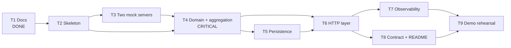

# Execution plan - Unified Document Viewer

> **Provenance.** Derived from `[DRAFT.md](DRAFT.md)` (requirements), `[SPEC.md](SPEC.md)` (commands,
> structure, boundaries) and `[SYSTEM_DESIGN.md](SYSTEM_DESIGN.md)` (design decisions). Requirement
> identifiers below refer to `DRAFT.md`.

Every task names the requirements it satisfies and the gate that proves it. A task without a gate is
not done, it is merely written.

Architecture: **Option 1**, chosen in `[DRAFT.md](DRAFT.md)` §6.3 and confirmed against five
alternatives in `[SYSTEM_DESIGN.md](SYSTEM_DESIGN.md)` §2.9. Sizes are relative, not estimates: **L** carries the
graded logic, **M** is ordinary build work, **S** is scaffolding or wiring.

---

## Ordering

T3 precedes T4 so the aggregator is developed against real upstreams from the outset, not against
fakes alone. T5 and T6 both depend on T4 because the cache policy and the HTTP status
selection are both driven by the aggregate result type.

---

## Tasks

| #      | Task                                                    | Satisfies                                         | Gate                                                                                                                                                                                                                                                                                                                                                                                                                                                                                                                                                                                                                                         | Size |
| ------ | ------------------------------------------------------- | ------------------------------------------------- | -------------------------------------------------------------------------------------------------------------------------------------------------------------------------------------------------------------------------------------------------------------------------------------------------------------------------------------------------------------------------------------------------------------------------------------------------------------------------------------------------------------------------------------------------------------------------------------------------------------------------------------------- | ---- |
| **T1** | **Design docs** - DRAFT, SPEC, system design, this plan | Part 1, all six elements                          | ✅ Six-element coverage map; architecture from DRAFT §6 confirmed against five alternatives (§2.9); 13 diagrams parse-checked; every section traced to a DRAFT identifier; additions isolated in SYSTEM_DESIGN §6.9                                                                                                                                                                                                                                                                                                                                                                                                                           | L    |
| **T2** | Scaffold + walking skeleton                             | A8, K5, R1-R6                                     | Module tree per SPEC §5 with both slices stubbed; `make help` and `make tools` both work; `make infra-up` brings up PostgreSQL 18 with a healthcheck, and `make dev` (infra + migrate + mocks + API) works from a clean clone; `configs` **package at the repository root is the only reader of environment variables**, and `Load()` **fails fast if the timeout ordering in SPEC §6 is violated**; `internal/<service>/app` is the composition root for each binary; `go run ./cmd/documentviewer` serves `/healthz`; every target listed by `make help` runs; graceful shutdown | S    |
| **T3** | **Two** mock servers                                    | FR2, A5                                           | ✅ `cmd/sales` on 9100 and `cmd/service` on 9101, **separate processes**; payload shapes match SYSTEM_DESIGN §5.3 and differ in naming, date format, nesting and type vocabulary; live chaos (success / 500 / timeout) plus generated unknown-VIN data; seed data for ≥20 VINs including one with **zero** documents (FR6); VIN-safe mock logs + `make lint`/`make test`                                                                                                                                                                                                                                                                                                                                    | M    |
| **T4** | `documents` **domain + use case (TDD)**                 | FR3, FR4, FR5, NFR1, NFR2, NFR3                   | **Four gates below.** All of it inside `documentviewer/modules/documents/{domain,app}` with zero I/O, driven through the ports in `app/ports.go`                                                                                                                                                                                                                                                                                                                                                                                                                                                                                                            | L    |
| **T5** | Persistence: cache + audit slices                       | FR8, FR9, FR10, NFR6, NFR7, NFR8, A9, A11, R3, R4 | `migrations/` holds golang-migrate pairs applied by `make migrate-up`; `shared/infra/postgres` exposes the pool and the Unit of Work; **one repository per table (R3)** and **no** `Begin`**/**`Commit` **inside any repository (R4)**; `documentviewer/modules/documents/infra/persistence` does TTL 60s reads/writes and the stale-while-error fallback, **partial never written** (NFR6), **read error falls through to upstreams** (NFR7); `documentviewer/modules/audit` writes a row on every request including invalid VIN and total failure (FR8) and **exposes no update or delete path** (NFR8); fake-clock tests via `shared/common/clock.go`                                  | M    |
| **T6** | HTTP layer                                              | FR1, FR6, FR7, NFR4                               | Status selection matches SYSTEM_DESIGN §5.4 exactly: `400 VIN_INVALID`, `200`+`[]` for unknown VIN, `503 ALL_SOURCES_UNAVAILABLE` only when all sources fail and no cache exists; DTO matches §5.2 in **snake_case** with exactly the six A4 fields; `httptest` coverage                                                                                                                                                                                                                                                                                                                                                                     | M    |
| **T7** | Observability                                           | NFR5                                              | slog JSON carrying `request_id` and `trace_id`; all nine metrics from SYSTEM_DESIGN §8.3 on `/metrics`; OTel spans where the two upstream spans **overlap**; **log-capture test asserting the full VIN never appears** (SPEC §8). Instrumentation Level C per §8.1                                                                                                                                                                                                                                                                                                                                                                           | M    |
| **T8** | Contract + README                                       | Deliverable 2                                     | `make openapi` regenerates `api/<service>/http/docs/` from handler annotations and `make openapi-check` passes; `examples/curl.md` runs against a live service; README covers build/run/test **and the AI Collaboration Narrative**                                                                                                                                                                                                                                                                                                                                                                                                                    | M    |
| **T9** | Demo rehearsal                                          | Deliverable 3                                     | Timed inside 5-10 minutes: happy path → kill the Service mock live → `partial: true` → `/metrics` → test suite                                                                                                                                                                                                                                                                                                                                                                                                                                                                                                                               | S    |

### T4 gates - the task the submission is judged on

1. **Failure isolation (NFR1).** A failing source must not cancel its healthy sibling. This is the `errgroup.WithContext` trap in SYSTEM_DESIGN DD-2. Uncaught it inverts NFR1, and it fails **silently** - the happy path still passes.
2. **Parallelism (FR3, NFR3).** Two sources each delayed 500ms complete in under 1s.
3. **VIN validation (A1).** Accepts 10 characters, rejects 9 and 11. Length and alphabet must come from **one** configurable rule, not scattered literals, so the ISO 3779 form is a constant change rather than a rewrite. Accepted risk: SPEC §11.1.
4. **All green under `-race`.**

T4 is the only task with more than one gate. It holds all the business logic the brief asks to be
validated by tests, and two of its failure modes are invisible to a happy-path suite.

---

## Cut list

If scope has to shrink, it shrinks in this order. Each is a deliberate deferral recorded in
SYSTEM_DESIGN §9.5, not a silent drop.

1. `singleflight` request collapsing - protects against a stampede a demo will never produce
2. OTLP exporter wiring - the stdout exporter already shows the span structure
3. Retry on transport error - the timeout budget already bounds the failure

## Never cut

- **T4 tests.** They are the "suite of tests that validate the core business logic" the brief requires by name.
- **T5 NFR6 and NFR7 tests.** They are the only proof the database improves availability rather than adding a failure mode.
- **README AI Collaboration Narrative.** One of four scored dimensions, and the most obviously absent when skipped.
- **The design documents.** Part 1 is half the assessment.
- **`make demo-degraded`.** Without it, FR7 is a claim rather than a demonstration.

---

## Requirement coverage

Every `DRAFT.md` requirement lands in a task. Nothing is orphaned.

| Task | Requirements                                                                 |
| ---- | ---------------------------------------------------------------------------- |
| T2   | A8 (plus the structural constraints in SPEC §5 and rules R1-R6 in AGENTS.md) |
| T3   | FR2, A5                                                                      |
| T4   | FR3, FR4, FR5, NFR1, NFR2, NFR3, A1                                          |
| T5   | FR8, FR9, FR10, NFR6, NFR7, NFR8, A9, A10, A11                               |
| T6   | FR1, FR6, FR7, NFR4, A6                                                      |
| T7   | NFR5                                                                         |

A2 (auth upstream) and A3 (single-tenant) are scoping assumptions with no implementation task; both
are recorded as extension points in SYSTEM_DESIGN §9.2 and §12.

---

## Status

- [x] **T1** - Design docs
- [x] **T2** - Scaffold and walking skeleton
- [x] **T3** - Two mock servers
- [x] **T4** - Domain and aggregation core
- [x] **T5** - Persistence: cache + audit slices
- [x] **T6** - HTTP layer (`feature/doc-viewer-task-6-http`, awaiting review)
- [ ] T7 - Observability
- [ ] T8 - Contract and README
- [ ] T9 - Demo rehearsal

**Not blocked.** SPEC §11 Q1-Q4 all have defaults. T6 mounts document routes and records audit on every request.